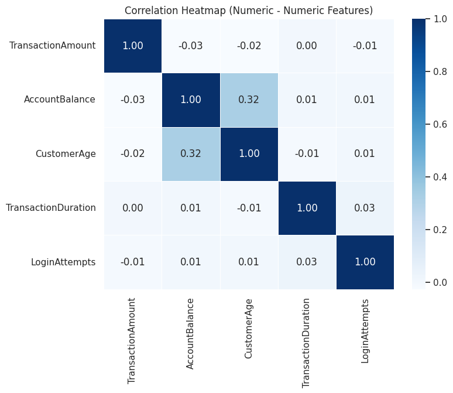
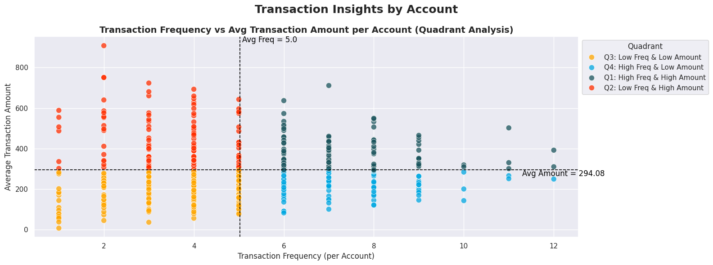
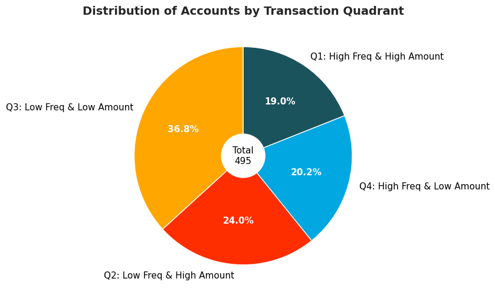
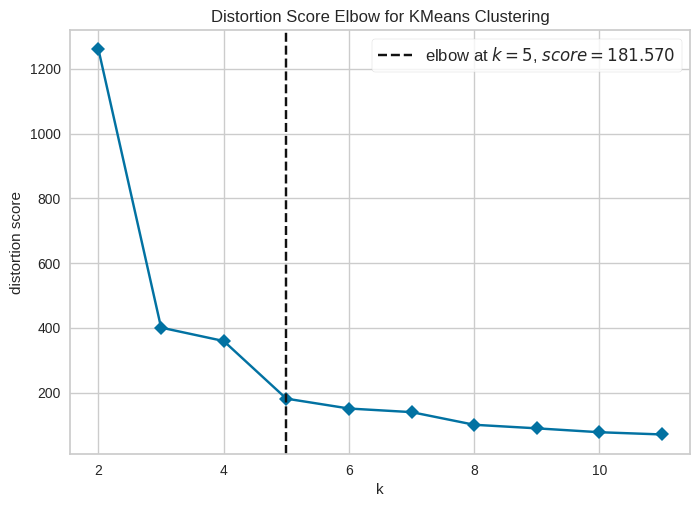
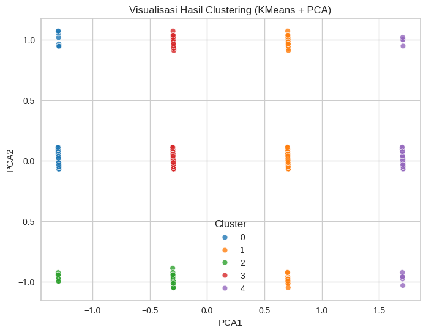
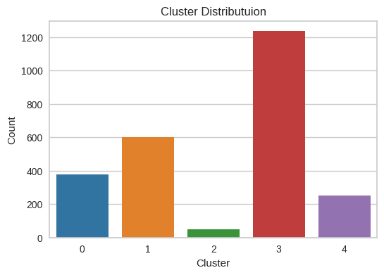

# 🧠 Bank Transaction Fraud Detection Using K-Means Clustering

This project aims to **detect potential fraudulent banking transactions** by analyzing customer behavioral patterns using **unsupervised learning (K-Means Clustering)**.  
The study focuses on how transaction frequency, amount, and behavioral signals (such as login attempts) can indicate unusual or high-risk activity.

---

## 📂 Project Structure

📁 data/
┣ raw.csv # Raw transactional dataset
┣ data.parquet # Cleaned and processed dataset
┗ data_clustering.csv # Clustered dataset (KMeans + PCA)

📁 src/
┣ 01. Exploratory Data Analysis.ipynb
┣ 02. Data Cleaning and Processing.ipynb
┗ 03. Model Clustering.ipynb

📁 models/
┣ model_cluster.h5 # Saved KMeans model
┗ PCA_model_clustering.h5 # Saved PCA projection model

---

## 🧩 Dataset Description

Each record represents a single banking transaction with behavioral and contextual features.

| Feature | Description |
|----------|-------------|
| `TransactionID` | Unique alphanumeric transaction identifier |
| `AccountID` | Unique account ID (one account may have multiple transactions) |
| `TransactionAmount` | Value of the transaction (currency-normalized) |
| `TransactionDate` | Date and time of the transaction |
| `TransactionType` | Type of transaction: Credit or Debit |
| `Location` | City where the transaction occurred |
| `DeviceID` | Device used for the transaction |
| `IP Address` | IPv4 address used during the transaction |
| `MerchantID` | Unique merchant identifier |
| `AccountBalance` | Account balance after the transaction |
| `PreviousTransactionDate` | Timestamp of the previous transaction |
| `Channel` | Channel used: Online, ATM, or Branch |
| `CustomerAge` | Customer’s age |
| `CustomerOccupation` | Customer’s occupation (e.g., Doctor, Engineer, Student, Retired) |
| `TransactionDuration` | Duration of the transaction (in seconds) |
| `LoginAttempts` | Number of login attempts before the transaction |

---

## 🧠 01. Exploratory Data Analysis

EDA was performed to understand relationships and behavioral distributions among customers.

### Key Visualizations:
1. **Correlation Heatmap** between numerical features  
   → Helped identify dependencies between transaction amount, balance, and login behavior.  
   

2. **Scatter Plot** showing 4 account behavior classes based on transaction frequency and amount  
    Q1: High Frequency & High Amount
    Q2: Low Frequency & High Amount
    Q3: Low Frequency & Low Amount
    Q4: High Frequency & Low Amount

    

3. **Pie Chart** of Account Class Distribution  
    → Displays the proportion of accounts in each behavioral class.  
    

---

## 🧹 02. Data Cleaning and Processing

Data preprocessing ensured consistency and readiness for clustering.

### Main Steps:
- **Handling Missing & Duplicated Values**  
- **Feature Scaling** for numerical features  
- **Encoding Categorical Variables** (TransactionType, Channel, etc.)  
- **Outlier Handling** using `quantile_winsorize_series`  
- **Feature Binning** for:
- `TransactionAmount` → `TransactionAmountBin`
- `LoginAttempts` → `LoginAttemptsBin`
- **Exported** final processed dataset as `data.parquet`

---

## ⚙️ 03. Model Clustering

K-Means clustering was used to detect patterns and potential anomalies in transaction behavior.

### 1. **K-Elbow Visualization**
- Evaluated optimal cluster count (`K = 5`) with distortion score = **181.570**

### 2. **Silhouette Score**
- Achieved a **silhouette score = 0.7439**, indicating strong separation among clusters.

### 3. **Cluster Analysis**
- Used features:
- `TransactionAmountBin`
- `LoginAttemptsBin`
- `TransactionCountTotal`

### 4. **Model Saving**
- Saved models:
- `model_cluster.h5`
- `PCA_model_clustering.h5`

---

## 🔍 PCA Visualization

Principal Component Analysis (PCA) was applied (`n_components = 2`) for dimensionality reduction and visualization.

| Component | Example Value |
|------------|----------------|
| PCA1 | -0.295447 |
| PCA2 | 0.018164 |

---

## 🧩 Cluster Interpretation

| Cluster | Behavior Summary |
|----------|------------------|
| **Cluster 0** | Moderate transaction behavior across all metrics |
| **Cluster 1** | Stable users with balanced activity |
| **Cluster 2** | High login attempts → potential fraud pattern |
| **Cluster 3** | Low transaction amount and frequency |
| **Cluster 4** | High-value transactions — possible premium or risky customers |

---

## 📊 Insights

- Customers with **high login attempts** and **low transaction history** tend to cluster together — potentially indicating suspicious activity.
- **PCA-based visualization** strengthens interpretability, revealing distinct cluster boundaries.
- The methodology can serve as a **foundation for anomaly detection or supervised fraud prediction** in future extensions.

---

## 💾 Output Files

| File | Description |
|------|-------------|
| `data_clustering.csv` | Clustered dataset with KMeans and PCA labels |
| `model_cluster.h5` | Trained KMeans clustering model |
| `PCA_model_clustering.h5` | PCA dimensionality reduction model |

---

## 🚀 Next Steps

1. Integrate additional features (e.g., IP address anomaly scoring)
2. Apply **PCA-based clustering analysis** to refine segmentation
3. Extend project with **fraud classification (supervised learning)**

---

## 🧑‍💻 Tech Stack

- Python (Pandas, NumPy, Scikit-learn)
- Matplotlib / Seaborn for visualization  
- Yellowbrick for cluster validation  
- Jupyter Notebook  
- Parquet for optimized data storage

---

## 📸 Preview Gallery

| Description | Preview |
|--------------|----------|
| Correlation Matrix |  |
| Behavior Scatter |  |
| K-Elbow Curve |  |
| PCA Clusters |  |

---

## 🧾 Summary

This project demonstrates how **unsupervised learning can uncover behavioral patterns** within financial transaction data, providing the foundation for **fraud detection** in digital banking environments.  
It highlights the integration of **EDA, feature engineering, clustering, and dimensionality reduction** to interpret complex transactional behaviors.

---

